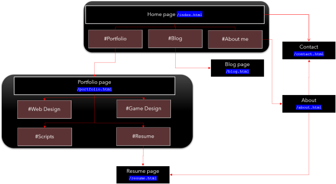

# ReadMe File for Punit Dharmadhikari's T1A2 Portfolio Project

The following is a ReadMe Markdown document in relation to the Portfolio Website created for Punit Dharmadhikari.

## **Link to Punit Dharmadhikari's Portfolio URL**
Please click [this link](https://punitdh.github.io/) to access Punit Dharmadhikari's Portfolio. Alternatively, please copy-paste the link below into a browser window (Google Chrome / Mozilla Firefox / Microsoft Edge recommended).

```
https://punitdh.github.io/
```

---

## **Description**

### **Purpose**
The purpose of this portfolio website is to establish with prospective client a sense of who I am, what I can do and what I have to offer. It is my professional showcase of information about my work and is executed in a wide range of ways — slideshows, thumbnail galleries, video presentations, etc. Ultimately the intent is to provide as much information to prospective leads, clients and employers as possible.


### **Functionality / Features**
The website has several pages. The homepage `index.html` contains a summary of my professional showcase of accomplishments as a full-stack web-developer, which links to other pages in the website which provides further information. On `resume.html`, a potential visitor may download my resume.


### **Sitemap**
This is the general sitemap  of the website.


### **Screenshots**
Screenshots of the project

### **Target Audience**
The intended target audience for this portfolio