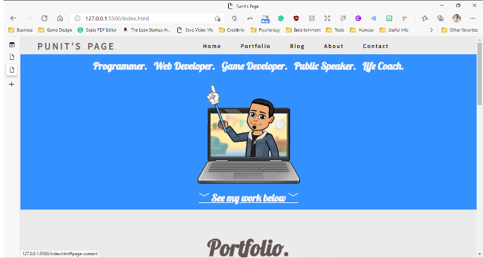

# ReadMe File for Punit Dharmadhikari's T1A2 Portfolio Project

The following is a ReadMe Markdown document in relation to the Portfolio Website created for Punit Dharmadhikari.

## **Links to Punit Dharmadhikari's Portfolio URL**
### **Punit Dharmadhikari's GitHub**
Please click [this link](https://punitdh.github.io/) to access Punit Dharmadhikari's Portfolio. Alternatively, please copy-paste the link below into a browser window (Google Chrome / Mozilla Firefox / Microsoft Edge recommended).

```
https://punitdh.github.io/
```
The portfolio website is also available on the Ed WorkSpace ([link](https://web.edusercontent.com/6bk2a3qitguho3q53mlk61dov0/) below).
### **Punit Dharmadhikari's Ed Workspace**
```
https://web.edusercontent.com/6bk2a3qitguho3q53mlk61dov0/
```

---

## **Description**

### **Purpose**
The purpose of this portfolio website is to establish with prospective clients  It is essentially a collection of who I am, what I can do and what I have to offer.  It is my professional showcase of information about my work and is executed in a wide range of ways — slideshows, thumbnail galleries, video presentations, etc. Ultimately the intent is to provide as much information to prospective leads, clients and employers as possible.


### **Functionality / Features**
The website has several pages. The homepage [`index.html`](https://punitdh.github.io/index.html) contains a summary of my professional showcase of accomplishments as a full-stack web-developer, which links to other pages in the website which provides further information. On [`resume.html`](https://punitdh.github.io/resume.html), a potential visitor may download my resume.

All pages have been validated using the W3 HTML and CSS Validators. All pages are 100% correct and accurate according to the Validator found at [https://validator.w3.org/](https://validator.w3.org/)


### **Sitemap**
This is the general sitemap  of the website.


### **Screenshots**
Please see screenshots of the project below.

| Index  | Description  |  Image |
|--------|--------------|--------|
| 1      | A shot of the box buttons in live action |                           |
| 2      | A screenshot of the contact.css CSS file |                           |
| 3      | A screenshot of the Contact Me page with the form visible |         |
| 4      | A screenshot of the .gitignore file |                                  |
| 5      | A screenshoft of the git log in the terminal |                   |
| 6      | A screenshot of the git log file gitlog.txt |                         |
| 7      | A screenshot of the homepage index.html |                               |
| 8      | A screenshot of the index.html HTML code |                            |
| 9      | A screenshot of the showNav() function in nav.js |                        |
| 10     | A screenshot of the navigation bar in a responsive design |   |
| 11     | A screenshot of the navigation bar |                                      |
| 12     | A screenshot of the Project checklist |                        |
| 13     | A screenshot of the terminal in use |                                   |


### **Target Audience**
I have close to 20 years experience programming in HTML, CSS and JavaScript, and other languages. I intended to create a portfolio website that showcased my work also while maintaining a clean, modern website. I looked around for inspiration and I really liked Harry Frankel's website (who is my instructor). I then reverse-engineered some of the elements of the website I really liked, along with several other elements from many different sources around the web to create a sleek, modern website that would suit my needs.

I used the learning material I learned from our online video lessons to design the "box hover buttons" on the `index.html` page. I added a 3D mouse-over effect after seeing a tutorial for it on the W3 website.

I decided to create my portfolio to show how I can create clean, modern, and stylish websites through my own portfolio. The intended target audience for this portfolio is any prospective employer or client looking for a web designer to fit their needs, and wants to learn more about me and my abilities.

I also intend to showcase all my side-projects and hobbies, interests, skills and personality. I designed this website in the hopes that I will be directed to work with exciting, interesting people and corporations to design web applications to meet their needs.

### **Tech Stack**
The following technology infrastructure was used in the building of the portfolio:
- HTML
- CSS
- JavaScript

The following software resources were used in the building of the portfolio website:
- Windows Powershell
- WSL: Ubuntu
- Visual Studio Code
- Git
- GitHub
- Vim and Nano
- Ed Workspace
- CodePen

The following Web browsers were used to test the portfolio website:
- Google Chrome
- Opera
- Microsoft Edge
- Mozilla Firefox
- Google Chrome (mobile)
- Responsively (desktop App to test web design)

The website was tested on the following resolutions:
- Desktop (1280 x 950), (1920 x 1080)
- iPad (768 x 1024)
- iPhoneX (375 x 812)
- Pixel2 (411 x 731)
- Moto G4 (360 x 640)
- Galaxy Note 8 (360 x 740)
- Galaxy Fold (280 x 653)
- Surface Duo (540 x 720)
- Samsung Watch (340 x 270)

The following resources were used as inspiration and as help in the building of the portfolio website:
- MDN Web Docs (https://developer.mozilla.org/en-US/)
- W3 Schools (https://www.w3schools.com/)
- CSS Navigation Bar Tutorial (https://www.w3schools.com/Css/css_navbar.asp)
- How To - Flip Card (https://www.w3schools.com/howto/howto_css_flip_card.asp) 
- Collection of CSS3 powered hover effects (https://ianlunn.github.io/Hover/)
- Harry Frankel's website used as inspiration for my own (https://harryfrankel.netlify.app/)

I'd like to give many thanks to CoderAcademy instructors Harry Frankel and Michael Bamford for the help and support they provided to me throughout this immensely enjoyable process.